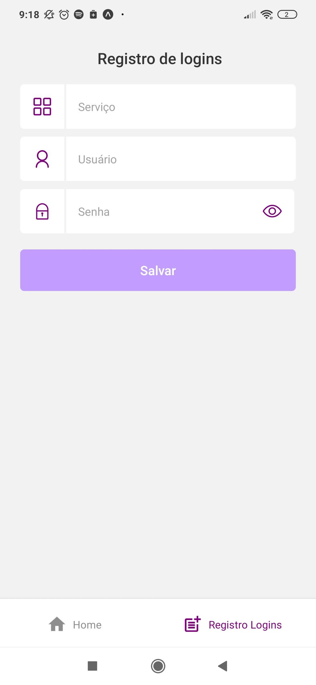

# Save Passwords App 🔐

Aplicação relizada para as matérias de Programação de Dispositivos Móveis e Segurança da Informação.   
Salva informações de logins (serviço, usuário e senha) utilizando o crypto-es para criptografia.   
Desenvolvida com React Native e Firebase.

## Project setup

 ```npm install``` 

## Run

 ```npm run dev ```
 (run with tunnel)


## Interfaces

<!-- ### Login
 -->

### Home


### Registro Login
<!--  -->
 
<!-- height="100"  -->


<!-- Links:
[Nomes de icones expo vector-icons](https://icons.expo.fyi ) -->
